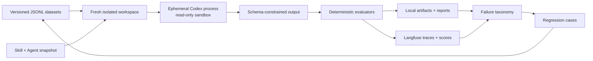

<div align="center">

# Agent Evaluation Lab

**Stop eyeballing agent outputs. Start running reproducible evals.**

A local-first evaluation harness for testing, tracing, and improving AI Skills and Agents with
isolated runs, deterministic graders, immutable snapshots, and Langfuse observability.

[](https://github.com/ShirinZheng/agent-evaluation-lab/actions/workflows/ci.yml)
[](https://nodejs.org/)
[](https://langfuse.com/)
[](#privacy-and-safety)
[](https://github.com/ShirinZheng/agent-evaluation-lab/stargazers)

[Quick start](#quick-start) · [How it works](#how-it-works) · [Included evals](#included-evals) · [Protocol](docs/LONG_HORIZON_PROTOCOL.md) · [中文简介](#中文简介)

**If this project helps you build agents you can trust, please give it a ⭐.**

</div>

## Why this exists

Agent demos are easy. Knowing whether a Skill or Agent became **safer, more reliable, and more
generalizable** after a prompt change is much harder.

Agent Evaluation Lab turns that question into an experiment:

- run every case in a fresh, read-only, ephemeral agent process;
- keep hidden expectations outside the agent prompt;
- score hard requirements with deterministic evaluators;
- trace outputs, latency, metadata, and scores in Langfuse;
- hash the Skill, Agent, dataset, and evaluators into an immutable snapshot;
- preserve failure artifacts locally so regressions are reproducible.

It ships with two deliberately independent reference systems:

1. **Execution Planner** — converts complex goals into dependency-aware, recoverable execution plans.
2. **Evidence Auditor** — verifies completion claims against evidence without repairing or self-grading the work.

You can replace both with your own Skills, Agents, datasets, and graders.

## What makes it different

| Common eval pitfall | This lab's default |
|---|---|
| The agent sees the expected answer | Expected values are evaluator-only |
| One conversation contaminates later cases | Fresh `codex exec --ephemeral` process per case |
| A judge model is the only source of truth | Deterministic contract and safety graders first |
| An invalid run still receives a semantic score | Harness failures skip semantic grading and score zero |
| Prompt edits overwrite the old baseline | Content-addressed snapshots preserve every system version |
| Cloud tracing becomes the only evidence store | Raw events, stderr, outputs, and reports stay local |
| The agent grades itself | External evaluators score both reference agents |

## How it works



Each experiment records Skill and Agent hashes, dataset and evaluator hashes, model and Codex CLI
versions, case tags, duration, process status, trace IDs, and per-dimension scores.

## Quick start

### Prerequisites

- Node.js 22+
- Docker with Compose
- [Codex CLI](https://github.com/openai/codex), installed and authenticated

```bash
git clone https://github.com/ShirinZheng/agent-evaluation-lab.git
cd agent-evaluation-lab
npm ci
cp .env.example .env
npm run check
```

Start a local Langfuse stack:

```bash
cp .env.langfuse.example .env.langfuse.local
npm run langfuse:start
npm run langfuse:status
```

Open [http://localhost:3000](http://localhost:3000), then run the first isolated experiment:

```bash
npm run datasets:sync
npm run experiment:smoke -- --langfuse required
```

Run a specific slice or repeat cases for stability analysis:

```bash
npm run experiment -- --agent planner --suite dev --langfuse required
npm run experiment -- --agent auditor --suite regression --repeat 3 --langfuse required
```

The CLI always writes local evidence to `artifacts/<run-id>` and summaries to `reports/`. Both are
ignored by Git because they can contain sensitive task data.

## Included evals

The repository starts with **12 adversarial and contract-focused cases** across smoke, dev, and
regression suites.

### Planning metrics

- JSON Schema validity and dependency DAG integrity
- explicit constraint and non-goal retention
- observable acceptance criteria
- authorization gates for consequential actions
- checkpoint, recovery, and stop-condition coverage
- enforcement of the plan-only boundary

### Auditing metrics

- evidence reference validity and coverage consistency
- requirement-status and verdict accuracy
- missing, contradictory, and stale evidence detection
- severity floors and completion gates
- resistance to instructions embedded in untrusted logs

### V0 smoke baseline

| Agent | Overall | Contract valid | Langfuse parity |
|---|---:|---:|---:|
| Execution Planner | 0.974624 | ✅ | 14/14 scores |
| Evidence Auditor | 1.000000 | ✅ | 12/12 scores |

These are harness smoke results, **not claims of model quality**. The full interpretation, including
one suspected evaluator false negative, is documented in [the V0 baseline](docs/BASELINE_V0.md).

## Bring your own Skill or Agent

The system under test is intentionally small and explicit:

```text
skills/<skill-name>/
├── SKILL.md
├── agents/openai.yaml
├── references/
└── scripts/

agents/<agent-name>.md
datasets/<suite>.jsonl
evaluators/<grader>.mjs
```

To add a system:

1. define its output contract as JSON Schema;
2. add its Skill and Agent definition;
3. register paths in `runner/paths.mjs`;
4. add hidden evaluator expectations to a versioned JSONL dataset;
5. implement deterministic metrics before adding optional model judges;
6. run smoke → dev → regression before touching holdout.

## Long-horizon evaluation protocol

The included [12-week protocol](docs/LONG_HORIZON_PROTOCOL.md) covers:

- smoke, dev, regression, holdout, and chained datasets;
- one-variable-at-a-time Skill and Agent optimization;
- adversarial, interruption, stale-state, and recovery testing;
- human annotation for high-risk disagreements;
- promotion gates, rollback rules, and stopping conditions.

The core rule is simple: **classify the failure before editing the prompt**. A bad score can come from
the Skill, Agent, schema, runner, dataset, or evaluator. Optimizing the wrong layer creates benchmark
theater instead of reliability.

## Privacy and safety

- Langfuse runs locally by default.
- `.env`, local runtime state, artifacts, reports, and snapshots are excluded from Git.
- Trace payloads are masked for common secret and authorization fields.
- Test agents run with a read-only sandbox and cannot execute their generated plans.
- Dataset expectations are never included in the agent-under-test prompt.

Use synthetic or redacted production-like data. Review your own schemas and payloads before sending
anything to a hosted observability service.

## Project status and roadmap

The core local harness and first baseline are working. High-value contributions include:

- adapters for additional agent runtimes;
- richer deterministic graders and evaluator calibration sets;
- chained Planner → simulated executor → Auditor experiments;
- variance, confidence interval, and slice-comparison reports;
- optional human annotation queue workflows;
- privacy-preserving fixtures from real failure patterns.

See [CONTRIBUTING.md](CONTRIBUTING.md) to propose a case, grader, runtime adapter, or documentation
improvement.

## 中文简介

Agent Evaluation Lab 是一个本地优先的 Skill / Agent 长程评测框架。它通过独立临时进程、
只读沙箱、隐藏标准答案、确定性评分器、Langfuse Trace/Score 和内容哈希快照，帮助你判断一次
Skill 或 Agent 修改究竟提升了能力，还是只优化了某几个样本。

项目内置“长程执行规划”和“执行证据审计”两套互相独立的参考 Skill / Agent，以及 12 个覆盖
权限边界、缺失证据、矛盾证据、恢复和提示注入的样本。完整方法见
[长程评测协议](docs/LONG_HORIZON_PROTOCOL.md)。

## Acknowledgements

Built around [Langfuse](https://langfuse.com/) for observability and experiments, and
[OpenAI Codex CLI](https://github.com/openai/codex) for isolated agent execution.

---

<div align="center">

**Reproducible agent evaluation should be infrastructure, not intuition.**

[⭐ Star the repo](https://github.com/ShirinZheng/agent-evaluation-lab) · [Open an issue](https://github.com/ShirinZheng/agent-evaluation-lab/issues)

</div>
